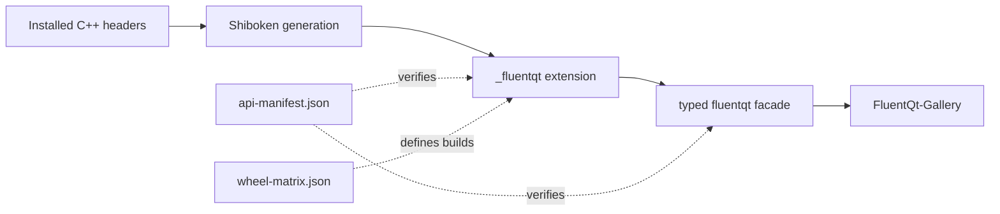

# PySide6 compatibility and coverage

> **Status:** Living compatibility and public-coverage reference

<!-- docs-nav:top:start -->
[Documentation](../../docs/README.md) › [Python bindings](README.md) › Compatibility and delivery

[← Python Publishing Runbook](PUBLISHING.md) · [Contents](../../docs/SUMMARY.md) · [Python bindings index](README.md)
<!-- docs-nav:top:end -->

FluentQt's Python package is a native extension, so support depends on the
combined CPython ABI, Qt/PySide6/Shiboken6 runtime, operating system, and CPU
architecture. This document defines the compatibility promise and the boundary
for public Python coverage. Exact exports and wheel rows remain machine-owned.

## Compatibility contract

- The C++ library supports Qt Widgets 5.15+ and 6.2+.
- Python bindings are optional, Qt 6-only, and disabled unless
  `FLUENT_QT_BUILD_PYSIDE6_BINDINGS=ON`.
- The minimum source/build gate is CPython 3.10 with
  Qt/PySide6/Shiboken6 6.2.4.
- PySide6, the Shiboken6 runtime and generator, and the C++ Qt SDK must match in
  version and architecture.
- All public Python modules re-export one native `_fluentqt` extension so Qt
  object identity, theme state, and resources remain process-wide.
- Importing `fluentqt` does not create a `QApplication`, initialize resources,
  or change the active theme.
- `FluentQt-Gallery` is a separate package that depends on the exact matching
  `FluentQt` version and imports only public APIs.
- PySide2, Qt 5 Python, PyPy, and 32-bit x86 are outside the supported contract.

## Support tiers

| Tier | Promise | Source of truth |
|---|---|---|
| Minimum compatibility | Generation, compilation, runtime behavior, and clean installation remain protected at the declared CPython 3.10 plus Qt 6.2.4 floor | Compatibility rows in [`wheel-matrix.json`](wheel-matrix.json) |
| Published wheels | Only listed CPython, platform, architecture, runtime, and wheel-tag combinations are downloadable promises | Release rows in [`wheel-matrix.json`](wheel-matrix.json) |
| Other matched Qt 6 toolchains | Source builds may work, but are not advertised as prebuilt support | Local build evidence |
| Public Python API | Names, modules, methods, enums, functions, variables, and deprecations are compatibility-checked | [`api-manifest.json`](api-manifest.json) and [API policy](API_COMPATIBILITY.md) |

Raising the CPython, Qt, PySide6, or Shiboken6 minimum is a compatibility
change. Update the matrix, policy, release notes, and migration guidance in the
same change.

## Coverage boundary

`api-manifest.json` is the executable public ledger. A C++ surface is supported
in Python only when its native wrapper, stable facade export, typing data,
ownership tests, and applicable Gallery example land together.

| Area | Published boundary |
|---|---|
| Basic input | Native controls, model-backed ComboBox, and the separate MultiSelectComboBox contract |
| Collections | Native item views with caller-owned models, selection models, and delegates |
| Date and time | Native values, locale-aware controls, and same-window picker popups |
| Dialogs and flyouts | Same-window overlays with explicit content ownership and lifecycle |
| Foundation | Theme tokens, `FluentWidget`, binding, state, anchor, and ownership adapters |
| Layout | Composition controls and explicit hosted-widget ownership |
| Menus and toolbars | QAction-based menus, command bars, and command flyouts |
| Navigation | Native route, metadata, overflow, selection, and page-host contracts |
| Scrolling | Native scroll controls plus borrowed connection and content adapters |
| Status and information | Native status controls, hosted actions, toasts, and tooltips |
| Text fields | Native editors, validation-compatible composition, and editing-command routing |
| Windowing | Window, TitleBar, native-event adaptation, and typed backdrop state |

Do not copy class or route counts into this document. Query the manifest or the
generated Gallery/catalog data when exact inventory is required.

## Optional modules

### Spatial composition

`fluentqt.spatial` exports `SpatialView` and `SpatialItem` when the binding is
built with `FLUENT_QT_BUILD_SPATIAL=ON`. Its optional API manifest, generated
stubs, ownership tests and [minimal example](examples/hello_world/spatial.py)
are separate from the default 2D exports. Both modules share the same native
extension and process-wide theme and motion state.

The [Spatial guide](../../docs/architecture/spatial-view.md) describes content
limits and renderer fallback. C++, Python and WebAssembly Gallery share the
Spatial category and one **Settings → 3D Gallery** switch. The Python shell
composes live navigation and content through Qt's OpenGL paint engine; component
examples use the native Spatial bindings. A base-only binding keeps the same
Gallery package in 2D without importing Qt OpenGL modules.
Enabling Spatial in a source build does not extend
the published wheel matrix or establish results for untested toolchains.

## Intentional exclusions

### Implementation surfaces

The following implementation surfaces remain outside the Python contract
unless a separate public design is accepted:

- raw `FluentElement` and `QMLPlus` multiple-inheritance mixins;
- mutable theme registries and overlay coordinators;
- private painters, presenters, accessibility adapters, and hosted child
  widgets;
- C++ callbacks expressed only as `std::function` when no reviewed Python
  callable adapter exists;
- overloads whose runtime ownership enum would be ambiguous in Python; and
- unsupported C++ prototypes that are not installed or exported publicly.

Applications use the stable Python-shaped facade rather than reaching into the
native module's implementation namespace.

## Ownership rules

- Application models, selection models, and delegates stay caller-owned. The
  facade retains their Python wrappers only while they are installed.
- Qt-owned children are borrowed. Python must not delete or reparent them.
- Hosted-widget APIs use explicit owned, borrowed, reparented, and take methods
  where lifetime would otherwise be unclear.
- Taking a hosted widget returns a parentless Python-owned object. Changing the
  current object's ownership policy requires taking and reinstalling it.
- Destruction, model replacement, reset, overlay close, and window teardown
  must release retained wrappers and stale focus targets.

These rules are part of API compatibility, not implementation advice.

## Required gates

| Change | Required evidence |
|---|---|
| Public symbol or signature | Manifest and generated-stub checks, runtime import, strict typing, and API policy |
| Hosted object or model boundary | Replacement, destruction, garbage collection, and Python subclass tests |
| Overlay or native window | Headless behavior plus the relevant real desktop platform review |
| Gallery route or sample | C++/Python catalog parity and executable source-snippet checks |
| Wheel or runtime matrix | Native build, clean installation, dependency resolution, and platform status for every affected row |
| Published artifact | Immutable bundle, TestPyPI rehearsal, tag/version checks, attestations, and public-index smoke |

The local build and focused test commands are maintained in the
[binding guide](README.md). Linux repair evidence belongs to the
[manylinux policy](MANYLINUX.md), and publication evidence belongs to the
[publishing runbook](PUBLISHING.md).

## Completion model

Python compatibility is evaluated at three levels:

1. **Core usable** — the package imports from a clean wheel and its core widgets
   support properties, signals, subclassing, ownership, and native runtime use.
2. **Feature complete** — every selected public C++ surface is either exported
   with its lifecycle and interaction contracts or explicitly excluded.
3. **Release complete** — every declared wheel row, typing/API gate, artifact
   check, and clean-install path passes for the release.

The current binding has completed the planned foundation, component, model,
overlay, native-window, Gallery, and distribution milestones. Future public C++
components still require an explicit same-release Python decision; completion
is not a waiver for later API parity.

## Milestone record

This compact record replaces the former per-slice test diary. Release notes,
the publishing record, and repository history retain dated evidence.

| Milestone | Outcome |
|---|---|
| M0 — Binding foundation | One optional Qt 6 extension, matched toolchain checks, startup API, generated facade, and clean-wheel smoke |
| M1 — Core widget surface | Basic controls, text fields, Window/TitleBar, themes, signals, subclassing, and ownership |
| M2 — Component coverage | Planned low-risk components exported with manifest, typing, example, and wheel checks |
| M3 — Hosted-widget ownership | Explicit Python lifetime adapters and garbage-collection coverage |
| M4 — Models and navigation | Caller-owned model/delegate contracts, navigation values, selection, and lifecycle |
| M4.5 — Foundation authoring | `FluentWidget`, `bind()`, `StateGroup`, `AnchorLayout`, and typed token access |
| M5 — Overlays and native windows | Same-window overlays, focus/lifetime contracts, and native platform review |
| M6 — Release distribution | Matrix-built wheels, Gallery package, TestPyPI/PyPI workflow, hashes, attestations, and clean public installs |

The initial publication evidence is summarized in
[PUBLISHING.md](PUBLISHING.md). Later API additions and behavior changes are
recorded in the matching [release notes](../../docs/releases/README.md), not in
this living compatibility page.

## Updating this contract

When the C++ public surface or binary matrix changes:

1. decide whether the API is supported in Python or intentionally C++-only;
2. update `api-manifest.json` or `wheel-matrix.json`;
3. update bindings, stubs, ownership tests, and Gallery examples together;
4. run the API policy, generated-contract, focused binding, and clean-wheel
   gates; and
5. record user-visible compatibility changes in release notes.

Do not add a hand-maintained export total or a second platform matrix to this
document.

<!-- docs-nav:bottom:start -->
---
[← Python Publishing Runbook](PUBLISHING.md) · [Contents](../../docs/SUMMARY.md) · [Python bindings index](README.md)
<!-- docs-nav:bottom:end -->
