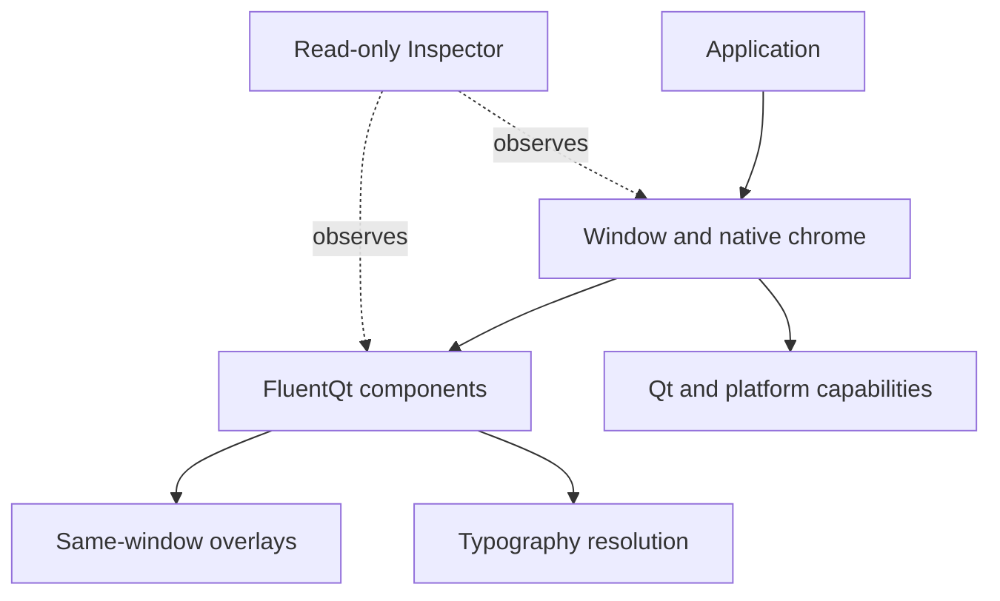

# Architecture

> **Status:** Current index

[Documentation home](../README.md) · [Contents](../SUMMARY.md)

These contracts describe behavior that component implementations must preserve.
Use the development guides for commands and review steps; use this section for
state, ownership, rendering, and platform boundaries.

| Contract | Use it when changing |
|---|---|
| [Files and feedback](files-and-feedback.md) | File entry, file model ownership, transfer presentation, or actionable Toast |
| [Charts](charts.md) | Model ownership, indexed projections, streaming, chart aggregation, or accessibility |
| [Spatial](spatial-view.md) | Compose existing controls with SpatialView and SpatialItem; examples, parameters, ownership and 2D fallback |
| [Overlay behavior](overlay-behavior.md) | Popup, Flyout, Dialog, TeachingTip, dropdown, drawer, or another same-window transient surface |
| [Window chrome](window-chrome.md) | Title bars, native move/resize, backdrops, hit testing, or platform window behavior |
| [Typography resolution](typography-resolution.md) | Fonts, inherited application typography, role resolution, or text scaling |
| [Inspector report](inspector-report.md) · [schema](inspector-report.schema.json) | Diagnostic rules, findings, generated workbenches, or report consumers |

Public compatibility rules are in the
[compatibility policy](../development/compatibility-policy.md). Visual choices
are governed by the [Fluent design contract](../design-languages/README.md).
