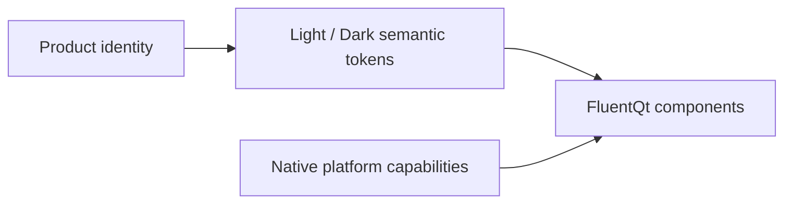

# Fluent Design Contract

> **Status:** Accepted visual contract

[Documentation home](../README.md) · [Contents](../SUMMARY.md)

Fluent is FluentQt's only visual language. Components share one geometry,
interaction, accessibility, and state contract across Windows, macOS, Linux,
and WebAssembly. Platform integration may differ, but component design does
not switch to a second brand shell.

Product identity changes content, accent, typography, and semantic tokens.
Platform capability changes chrome and material. Neither creates a second
component geometry or interaction language.

## 1.7 migration

Version 1.7 removes the former design-language selector instead of preserving
single-value or no-op compatibility APIs.

| Removed C++ surface | Replacement |
|---|---|
| `FluentElement::DesignLanguage` and `themeDesignLanguage()` | No replacement; components are always Fluent |
| `ThemeRegistry::designLanguage()` / `setDesignLanguage()` | Light/Dark `FluentElement::Theme` plus semantic token snapshots |
| `StyleTheme` and `StyleThemeCatalog` | `UserTheme::apply()` and Fluent token customization |

| Removed PySide6 surface | Replacement |
|---|---|
| `DesignLanguage` and `current_design_language()` | `Theme` and `current_theme()` |
| `FluentWidget.design_language()` | `FluentWidget.effective_theme()` and `theme_tokens()` |
| `StyleTheme` and `apply_style_theme()` | `apply_user_theme()`, `set_accent_color()`, and `reset_theme_tokens()` |

Old Material/Cupertino paint branches, Gallery choices, binding entries,
tests, documentation, and image assets were removed in the same release.
An existing Gallery `settings/styleTheme` value is ignored, so the Gallery
starts with Fluent on 1.7. Former `material.json` or `macos.json` user files
are left untouched but are no longer read; `fluent.json` remains the only
supported user token override.

## Runtime mapping

| Layer | Responsibility |
|---|---|
| [`ThemeRegistry`](../../src/components/foundation/ThemeRegistry.h) | Stores active Light/Dark Fluent colors, radius, and typography |
| [`UserTheme`](../../src/components/foundation/UserTheme.h) | Loads the optional `fluent.json` token override and manages accent customization |
| Component paint paths | Implement the single Fluent geometry and interaction contract |
| Platform/windowing layer | Adapts native chrome, input, and Mica/Acrylic capability without changing component design language |

Product branding belongs in complete Light/Dark semantic token overrides,
accent color, typography, and content—not alternate component geometry.
Hover, press, focus, disabled, and selected states must remain visible in both
modes.

## References

- [Fluent token and component reference](fluent.md)
- [Design kit source](figma-sources.md)
- [Component API conventions](../development/component-api-conventions.md)
- [Visual review](../development/visual-review.md)

For application colors and per-component settings, see
[Custom themes and component overrides](custom-themes.md).
